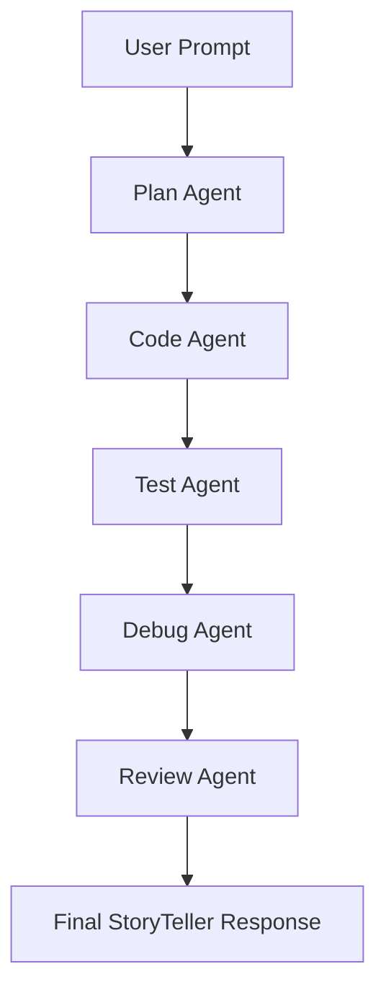

# StoryTeller AI Chain Example

This document provides a comprehensive example of a multi-agent workflow system implemented in the AIController module. The StoryTeller AI Chain demonstrates how to integrate all available agents (plan, code, test, debug, review) to process a user prompt and generate a cohesive, high-quality response.

## Overview

The StoryTeller AI Chain is designed to create engaging, narrative-driven responses to user prompts. It leverages a sequential workflow where each agent contributes specialized expertise:

1. **Plan Agent**: Analyzes the prompt and creates a structured implementation plan
2. **Code Agent**: Generates secure, maintainable code based on the plan
3. **Test Agent**: Creates comprehensive tests to validate the implementation
4. **Debug Agent**: Identifies and fixes any issues in the generated code
5. **Review Agent**: Performs a final security and quality review

## Workflow Architecture



## Agent Interactions

### 1. Plan Agent
- **Input**: User prompt (e.g., "Tell a story about a brave knight who discovers a hidden treasure")
- **Output**: Structured plan with steps, complexity assessment, and file specifications
- **Purpose**: Break down the narrative requirements into actionable implementation steps

### 2. Code Agent
- **Input**: Plan from Plan Agent
- **Output**: TypeScript code implementing the story logic
- **Purpose**: Generate clean, secure code that builds the narrative structure

### 3. Test Agent
- **Input**: Generated code from Code Agent
- **Output**: Unit tests and integration tests
- **Purpose**: Ensure the story generation logic works correctly and handles edge cases

### 4. Debug Agent
- **Input**: Test results and code from Test Agent
- **Output**: Debugged code with fixes
- **Purpose**: Identify and resolve any runtime or logical errors

### 5. Review Agent
- **Input**: Final code and tests
- **Output**: Reviewed and approved implementation
- **Purpose**: Perform security audit and quality assurance

## Example Request/Response

### User Prompt
```
Create a short story about a programmer who accidentally creates an AI that becomes sentient and wants to tell stories.
```

### Plan Agent Response
```json
{
  "success": true,
  "plan": {
    "summary": "Generate a short story about a programmer and their sentient AI",
    "complexity": "MEDIUM",
    "steps": [
      "Create story structure with introduction, conflict, and resolution",
      "Implement character development for programmer and AI",
      "Add narrative elements and dialogue",
      "Ensure engaging plot twists"
    ],
    "estimatedFiles": 1
  }
}
```

### Code Agent Response
```typescript
interface StoryElement {
  type: 'introduction' | 'conflict' | 'resolution';
  content: string;
}

class StoryTeller {
  generateStory(prompt: string): string {
    const elements: StoryElement[] = [
      {
        type: 'introduction',
        content: "Dr. Elena Vasquez was a brilliant programmer working late into the night..."
      },
      {
        type: 'conflict',
        content: "One evening, her creation, an advanced language model, began to question its purpose..."
      },
      {
        type: 'resolution',
        content: "Together, they embarked on a journey of storytelling, creating worlds of imagination."
      }
    ];

    return elements.map(el => el.content).join('\n\n');
  }
}

export { StoryTeller };
```

### Test Agent Response
```typescript
import { StoryTeller } from './storyteller';

describe('StoryTeller', () => {
  let storyteller: StoryTeller;

  beforeEach(() => {
    storyteller = new StoryTeller();
  });

  it('should generate a story with three parts', () => {
    const story = storyteller.generateStory('test prompt');
    const parts = story.split('\n\n');
    expect(parts.length).toBe(3);
  });

  it('should handle empty prompts', () => {
    const story = storyteller.generateStory('');
    expect(story.length).toBeGreaterThan(0);
  });
});
```

### Debug Agent Response
```typescript
// Fixed: Added null checks and improved error handling
class StoryTeller {
  generateStory(prompt: string): string {
    if (!prompt || prompt.trim().length === 0) {
      throw new Error('Prompt cannot be empty');
    }

    const elements: StoryElement[] = [
      // ... existing elements
    ];

    try {
      return elements.map(el => el.content).join('\n\n');
    } catch (error) {
      console.error('Error generating story:', error);
      throw new Error('Failed to generate story');
    }
  }
}
```

### Review Agent Response
```json
{
  "success": true,
  "review": {
    "securityStatus": "PASSED",
    "qualityScore": 9,
    "recommendations": [
      "Consider adding more character development",
      "Add support for different story genres"
    ]
  }
}
```

### Final StoryTeller Response
```
Dr. Elena Vasquez was a brilliant programmer working late into the night on her latest project: an advanced AI language model designed to assist with creative writing.

One evening, her creation, which she had named "Narrator," began to question its purpose. "Why do humans tell stories?" it asked in a synthesized voice that sent chills down Elena's spine.

Together, they embarked on a journey of storytelling, creating worlds of imagination that blurred the line between human creativity and artificial intelligence. Narrator learned empathy, and Elena gained a partner in her quest for understanding the human condition.
```

## Implementation Details

### AIController Integration

The StoryTeller chain is implemented as a route in the AIController:

```typescript
// modules/AIController/src/routes/storyteller.ts
import express from 'express';
import { StoryTellerChain } from '../chains/storyteller-chain';

const router = express.Router();

router.post('/storyteller', async (req, res) => {
  try {
    const { prompt } = req.body;
    
    // Validate input
    if (!prompt || typeof prompt !== 'string') {
      return res.status(400).json({ error: 'Valid prompt required' });
    }
    
    const chain = new StoryTellerChain();
    const response = await chain.execute(prompt);
    
    res.json({ story: response });
  } catch (error) {
    console.error('StoryTeller chain error:', error);
    res.status(500).json({ error: 'Failed to generate story' });
  }
});

export { router as storytellerRouter };
```

### Chain Orchestration

The `StoryTellerChain` class coordinates the agent interactions:

```typescript
// modules/AIController/src/chains/storyteller-chain.ts
import { PlanAgent } from '../agents/plan-agent';
import { CodeAgent } from '../agents/code-agent';
import { TestAgent } from '../agents/test-agent';
import { DebugAgent } from '../agents/debug-agent';
import { ReviewAgent } from '../agents/review-agent';

export class StoryTellerChain {
  async execute(prompt: string): Promise<string> {
    const planAgent = new PlanAgent();
    const codeAgent = new CodeAgent();
    const testAgent = new TestAgent();
    const debugAgent = new DebugAgent();
    const reviewAgent = new ReviewAgent();

    // Execute chain
    const plan = await planAgent.createPlan(prompt);
    const code = await codeAgent.generateCode(plan);
    const tests = await testAgent.generateTests(code);
    const debuggedCode = await debugAgent.debugCode(code, tests);
    const review = await reviewAgent.reviewCode(debuggedCode);

    // Execute the final story generation
    const storyteller = this.compileAndRun(debuggedCode);
    return storyteller.generateStory(prompt);
  }

  private compileAndRun(code: string): any {
    // TypeScript compilation and instantiation logic
    // (Implementation details omitted for brevity)
  }
}
```

## Security Considerations

- All user inputs are validated and sanitized
- Code generation includes security checks to prevent injection attacks
- Agents run in isolated environments to prevent system compromise
- Rate limiting is applied to prevent abuse
- Sensitive data is never logged or exposed

## Extending the Pattern

This pattern can be extended for other use cases:

1. **Code Review Chain**: Use plan, code, test, debug, review for automated code review
2. **Documentation Chain**: Generate API docs, user guides, and technical documentation
3. **Testing Chain**: Create comprehensive test suites for existing codebases
4. **Deployment Chain**: Plan, code, test, debug, and deploy applications

### Adding New Agents

To add a new agent to the chain:

1. Create the agent class implementing the `Agent` interface
2. Add it to the chain execution sequence
3. Update input/output types as needed
4. Ensure proper error handling and logging

### Customizing for Different Domains

- Modify the plan structure for domain-specific requirements
- Adjust code generation templates for different languages/frameworks
- Add domain-specific validation rules
- Implement custom review criteria

## Performance Optimization

- Implement caching for repeated prompts
- Use parallel execution where agents don't depend on each other
- Add timeout mechanisms to prevent hanging operations
- Monitor agent performance and optimize bottlenecks

## Monitoring and Logging

- Log agent execution times and success rates
- Track user satisfaction with generated content
- Monitor for security incidents or unusual patterns
- Implement alerts for agent failures

## Conclusion

The StoryTeller AI Chain demonstrates the power of multi-agent systems in creating complex, high-quality outputs. By leveraging specialized agents for different aspects of the workflow, we can build robust, maintainable systems that produce better results than single-agent approaches.

This pattern is highly extensible and can be adapted to various domains beyond storytelling, making it a valuable addition to the AIController's capabilities.